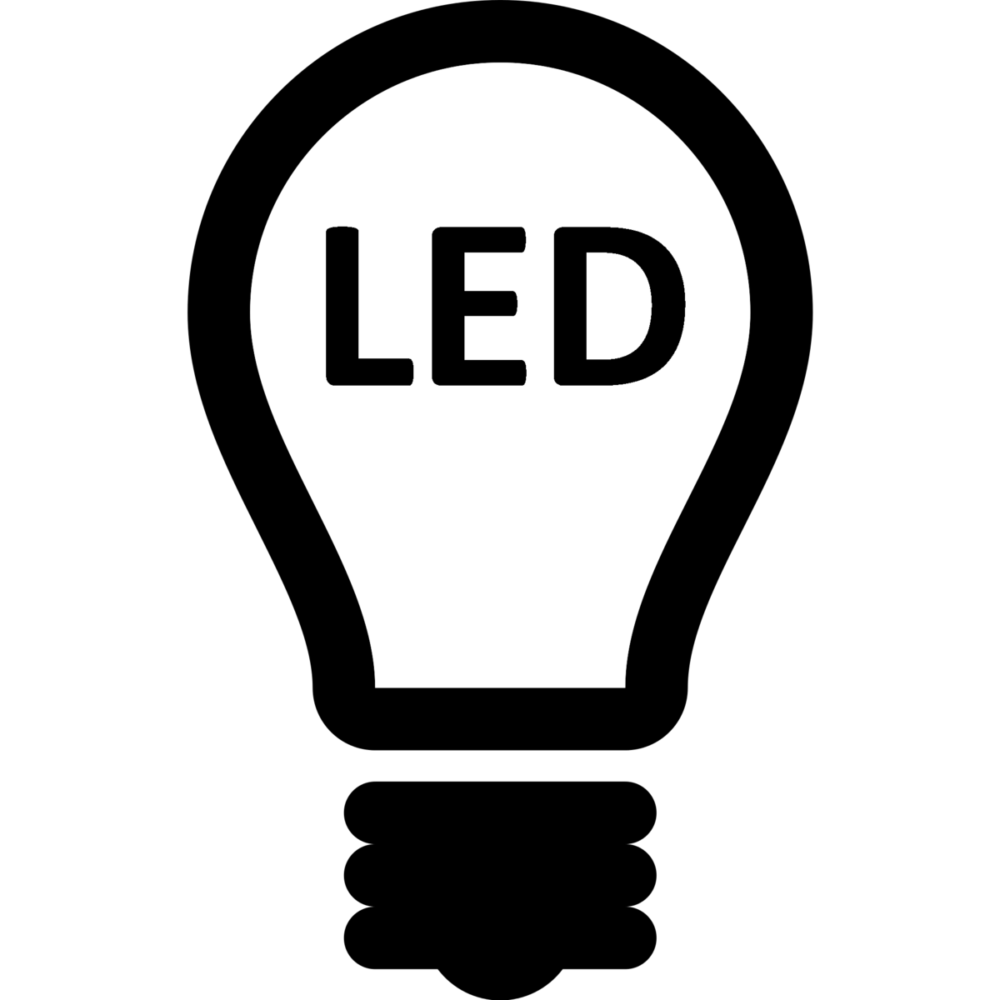

<!-- Improved compatibility of back to top link: See: https://github.com/othneildrew/Best-README-Template/pull/73 -->

<!--
*** Thanks for checking out the Best-README-Template. If you have a suggestion
*** that would make this better, please fork the repo and create a pull request
*** or simply open an issue with the tag "enhancement".
*** Don't forget to give the project a star!
*** Thanks again! Now go create something AMAZING! :D
-->

<!-- PROJECT SHIELDS -->
<!--
*** I'm using markdown "reference style" links for readability.
*** Reference links are enclosed in brackets [ ] instead of parentheses ( ).
*** See the bottom of this document for the declaration of the reference variables
*** for contributors-url, forks-url, etc. This is an optional, concise syntax you may use.
*** https://www.markdownguide.org/basic-syntax/#reference-style-links
-->
[![Contributors][contributors-shield]][contributors-url]
[![Forks][forks-shield]][forks-url]
[![Stargazers][stars-shield]][stars-url]
[![Issues][issues-shield]][issues-url]
[![LinkedIn][linkedin-shield]][linkedin-url]

<!-- PROJECT LOGO -->
 

  

<h3 align="center">Custom IoT LED Control for TV and Christmas Lights</h3>

  

    <!--  
    <a href="https://github.com/barillamw/Project-CustomSmartLights"><strong>Explore the docs »</strong></a>
     
     
    <a href="https://github.com/barillamw/Project-CustomSmartLights">View Demo</a>
    ·
    <a href="https://github.com/barillamw/Project-CustomSmartLights/issues">Report Bug</a>
    ·
    <a href="https://github.com/barillamw/Project-CustomSmartLights/issues">Request Feature</a> -->
  

<!-- TABLE OF CONTENTS -->

  
Table of Contents

  <ol>
    <li>
      <a href="#about-the-project">About The Project</a>
      <ul>
        <li><a href="#built-with">Built With</a></li>
      </ul>
    </li>
    <li>
      <a href="#getting-started">Getting Started</a>
      <ul>
        <li><a href="#prerequisites">Prerequisites</a></li>
        <li><a href="#installation">Installation</a></li>
      </ul>
    </li>
    <li><a href="#usage">Usage</a></li>
    <li><a href="#roadmap">Roadmap</a></li>
    <li><a href="#contributing">Contributing</a></li>
    <li><a href="#license">License</a></li>
    <li><a href="#contact">Contact</a></li>
    <li><a href="#acknowledgments">Acknowledgments</a></li>
  </ol>

<!-- ABOUT THE PROJECT -->
## About The Project

<!-- [![Product Name Screen Shot][product-screenshot]](https://example.com)` -->

 This project leverages the power of C programming language to create custom IoT devices that control LED lights in two distinct scenarios: TV Lights and Christmas Lights. By combining a Raspberry Pi and a mini Arduino for TV Lights, and utilizing a Node MCU with a web server for Christmas Lights, this project showcases the versatility of IoT applications in home automation and decoration.

### TV Lights
The TV Lights component of this project involves a Raspberry Pi that captures the image displayed on a TV screen. This image is processed to extract dominant colors, and the RGB values of these colors are then communicated to a mini Arduino. The mini Arduino takes the RGB values and illuminates the connected LED lights accordingly, creating an immersive ambient lighting experience that complements the on-screen content.

### Christmas Lights
The Christmas Lights component utilizes a Node MCU, a low-cost open-source IoT platform based on the ESP8266 WiFi module. The Node MCU runs a web server that enables users to control the RGB colors and pattern effects of the lights on a Christmas tree. Through a user-friendly web interface, individuals can select from a range of predefined color palettes and lighting patterns, making it a delightful addition to holiday decorations.

(<a href="#readme-top">back to top</a>)

### Built With
[![CPP][CPP]][CPP-url]
[![C][C]][C-url]
[![RapsberryPi][RapsberryPi]][RaspberryPi-url]
[![Arduino][Arduino]][Arduino-url]

* **C Programming Language**: The core programming language used to develop the custom IoT devices, allowing for efficient communication and control of LED lights.

* **Raspberry Pi**: Employs image processing to extract dominant colors from the TV screen and communicates with the mini Arduino to synchronize the lighting with on-screen content.

* **Arduino**: Utilized in the TV Lights scenario to process RGB values received from the Raspberry Pi and control the LED lights accordingly.

* **Node MCU**: Powers the Christmas Lights setup, running a web server that enables users to adjust colors and patterns using a web interface.
* **ESP8266 WiFi Module**: Integrated within the Node MCU, it provides WiFi connectivity, enabling seamless interaction with the Christmas lights via the web server.

(<a href="#readme-top">back to top</a>)

<!-- USAGE EXAMPLES -->
## Usage

1. **TV Lights**: Run Hyperion on the Raspberry Pi script to capture and process the TV screen image. The script communicates the RGB values to the mini Arduino code provided, which controls the LED lights accordingly.

2. **Christmas Lights**: Upload the provided code to the Node MCU. Connect the Node MCU to the Christmas tree's LED lights and your home network. Power on the Node MCU and access the web server to adjust colors and patterns in real time.

(<a href="#readme-top">back to top</a>)

<!-- ROADMAP -->
## Roadmap

- [x] Always On Capabilities
- [x] Improved LED Integration
- [ ] Custom PCB board for hanging

(<a href="#readme-top">back to top</a>)

<!-- LESSONS -->
## Lessons Learned
This project was a great first experience supporting both hardware and software for multiple end users. Thinking through the usability of a solution from a non-technical perspective helped me to create a product that was useful to a wider audience. 

<!-- CONTRIBUTING -->
## Contributing

Contributions are what make the open source community such an amazing place to learn, inspire, and create. Any contributions you make are **greatly appreciated**.

(<a href="#readme-top">back to top</a>)

<!-- CONTACT -->
## Contact

Your Name - mbarill@ncsu.edu.com

Project Link: [https://github.com/barillamw/Project-CustomSmartLights](https://github.com/barillamw/Project-CustomSmartLights)

(<a href="#readme-top">back to top</a>)

<!-- MARKDOWN LINKS & IMAGES -->
<!-- https://www.markdownguide.org/basic-syntax/#reference-style-links -->
[contributors-shield]: https://img.shields.io/github/contributors/barillamw/Project-CustomSmartLights.svg?style=for-the-badge
[contributors-url]: https://github.com/barillamw/Project-CustomSmartLights/graphs/contributors
[forks-shield]: https://img.shields.io/github/forks/barillamw/Project-CustomSmartLights.svg?style=for-the-badge
[forks-url]: https://github.com/barillamw/Project-CustomSmartLights/network/members
[stars-shield]: https://img.shields.io/github/stars/barillamw/Project-CustomSmartLights.svg?style=for-the-badge
[stars-url]: https://github.com/barillamw/Project-CustomSmartLights/stargazers
[issues-shield]: https://img.shields.io/github/issues/barillamw/Project-CustomSmartLights.svg?style=for-the-badge
[issues-url]: https://github.com/barillamw/Project-CustomSmartLights/issues
[license-shield]: https://img.shields.io/github/license/barillamw/Project-CustomSmartLights.svg?style=for-the-badge
[license-url]: https://github.com/barillamw/Project-CustomSmartLights/blob/master/LICENSE.txt
[linkedin-shield]: https://img.shields.io/badge/-LinkedIn-black.svg?style=for-the-badge&logo=linkedin&colorB=555
[linkedin-url]: https://linkedin.com/in/michael-barilla
[product-screenshot]: images/screenshot.png
[Next.js]: https://img.shields.io/badge/next.js-000000?style=for-the-badge&logo=nextdotjs&logoColor=white
[Next-url]: https://nextjs.org/
[React.js]: https://img.shields.io/badge/React-20232A?style=for-the-badge&logo=react&logoColor=61DAFB
[React-url]: https://reactjs.org/
[Vue.js]: https://img.shields.io/badge/Vue.js-35495E?style=for-the-badge&logo=vuedotjs&logoColor=4FC08D
[Vue-url]: https://vuejs.org/
[Angular.io]: https://img.shields.io/badge/Angular-DD0031?style=for-the-badge&logo=angular&logoColor=white
[Angular-url]: https://angular.io/
[Svelte.dev]: https://img.shields.io/badge/Svelte-4A4A55?style=for-the-badge&logo=svelte&logoColor=FF3E00
[Svelte-url]: https://svelte.dev/
[Laravel.com]: https://img.shields.io/badge/Laravel-FF2D20?style=for-the-badge&logo=laravel&logoColor=white
[Laravel-url]: https://laravel.com
[Bootstrap.com]: https://img.shields.io/badge/Bootstrap-563D7C?style=for-the-badge&logo=bootstrap&logoColor=white
[Bootstrap-url]: https://getbootstrap.com
[JQuery.com]: https://img.shields.io/badge/jQuery-0769AD?style=for-the-badge&logo=jquery&logoColor=white
[JQuery-url]: https://jquery.com 
[C]: https://img.shields.io/badge/c-%2300599C.svg?style=for-the-badge&logo=c&logoColor=white
[C-url]: https://www.open-std.org/jtc1/sc22/wg14/
[Arduino]: https://img.shields.io/badge/-Arduino-00979D?style=for-the-badge&logo=Arduino&logoColor=white
[Arduino-url]: https://www.arduino.cc/
[RapsberryPi]: https://img.shields.io/badge/-RaspberryPi-C51A4A?style=for-the-badge&logo=Raspberry-Pi
[RaspberryPi-url]: https://www.raspberrypi.com/
[CPP]: https://img.shields.io/badge/c++-%2300599C.svg?style=for-the-badge&logo=c%2B%2B&logoColor=white
[CPP-url]: https://isocpp.org/